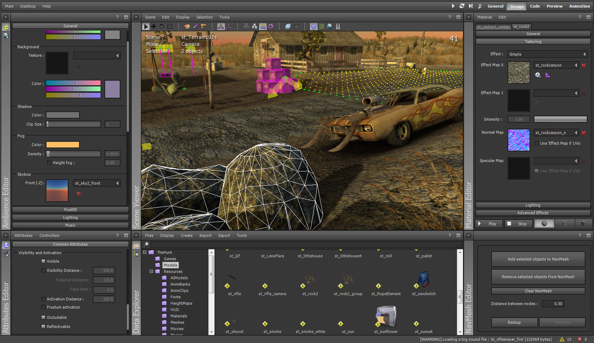

# ᕙ⁠(⁠⇀⁠‸⁠↼⁠‶⁠)⁠ᕗ⚠️🫠ATTENTION! THIS IS A CURVED VERSION.🫠⚠️(⁠゜⁠o⁠゜⁠;

ෆ⁠╹⁠ ⁠.̮⁠ ⁠╹⁠ෆ A full ShiVa extractor will be released soon! But you can also use it to decompile .lub files if you use a different extractor for ShiVa3D🐺🔎

# ShiVa-Decomplete-Lua-5.0乁⁠(⁠ ⁠•⁠_⁠•⁠ ⁠)⁠ㄏ
Lua file unpacking plugin for Engine Shiva, Lua version 5.0🟣⚪

# ShiVa Lua 5.0 Decompiler👾¯⁠\⁠_⁠(⁠ツ⁠)⁠_⁠/⁠¯

Decompiler for Lua 5.0 bytecode used in ShiVa3D games.

## Features🫠(⁠｡⁠・⁠/⁠/⁠ε⁠/⁠/⁠・⁠｡⁠)
- Parses Lua 5.0 chunks
- Restores constants
- Decodes instructions
- Reconstructs readable Lua code

## Usage

python lua50_decompiler.py file.lub 

## what does👾😈

restores different cycles

# 🫠👾The purpose of the decompiler xD!!

→ for modding•́⁠ ⁠ ⁠‿⁠ ⁠,⁠•̀

→ for reverse engineering (⁠◕⁠ᴗ⁠◕⁠✿⁠)

→ to search for vulnerabilities(⁠ ⁠◜⁠‿⁠◝⁠ ⁠)⁠♡

### I take no responsibility for your purpose for this decompiler 👥

We don't support it if you use a cheating tool, but we are not responsible for it🔑ヘ⁠（⁠。⁠□⁠°⁠）⁠ヘ

We wish everyone good luck who will use this decompiler! (⁠◍⁠•⁠ᴗ⁠•⁠◍⁠)⁠❤

 
